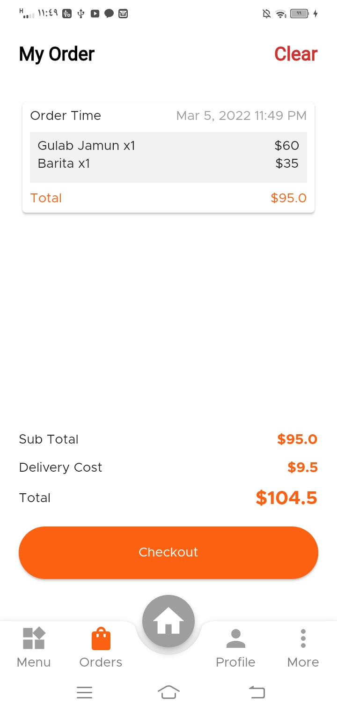

A new open source Delivery App created using Flutter, Firebase, Google Maps and Bloc as State Management.

# Features :

* Sign-In, Sign-Up and LogOut using Email & Password / Google Account / Facebook Account.
* Using Modular Bloc Architecture, Custom widgets and Clean reusable code.
* Using Bloc(Cubit) as a state management.
* Using Firebase Firestore as a backend.
* Using Google Maps API.

## Screen Shots
 
 
 
 
 

